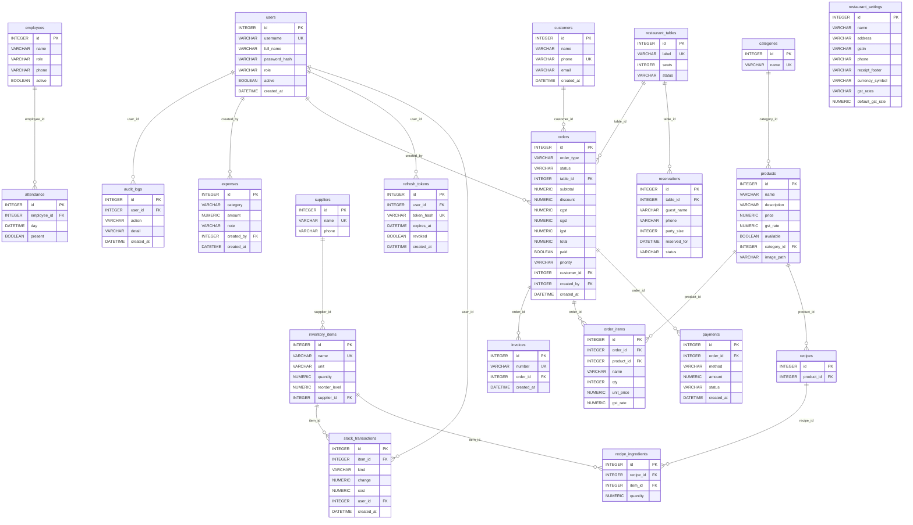

# Database ER Diagram

Generated from the SQLAlchemy models (renders on GitHub or in any Mermaid viewer).

```mermaid
erDiagram
    employees ||--o{ attendance : "employee_id"
    users ||--o{ audit_logs : "user_id"
    users ||--o{ expenses : "created_by"
    suppliers ||--o{ inventory_items : "supplier_id"
    restaurant_tables ||--o{ orders : "table_id"
    customers ||--o{ orders : "customer_id"
    users ||--o{ orders : "created_by"
    categories ||--o{ products : "category_id"
    users ||--o{ refresh_tokens : "user_id"
    restaurant_tables ||--o{ reservations : "table_id"
    orders ||--o{ invoices : "order_id"
    orders ||--o{ order_items : "order_id"
    products ||--o{ order_items : "product_id"
    orders ||--o{ payments : "order_id"
    products ||--o{ recipes : "product_id"
    inventory_items ||--o{ stock_transactions : "item_id"
    users ||--o{ stock_transactions : "user_id"
    recipes ||--o{ recipe_ingredients : "recipe_id"
    inventory_items ||--o{ recipe_ingredients : "item_id"
    categories {
        INTEGER id PK
        VARCHAR name UK
    }
    customers {
        INTEGER id PK
        VARCHAR name
        VARCHAR phone UK
        VARCHAR email
        DATETIME created_at
    }
    employees {
        INTEGER id PK
        VARCHAR name
        VARCHAR role
        VARCHAR phone
        BOOLEAN active
    }
    restaurant_settings {
        INTEGER id PK
        VARCHAR name
        VARCHAR address
        VARCHAR gstin
        VARCHAR phone
        VARCHAR receipt_footer
        VARCHAR currency_symbol
        VARCHAR gst_rates
        NUMERIC default_gst_rate
    }
    restaurant_tables {
        INTEGER id PK
        VARCHAR label UK
        INTEGER seats
        VARCHAR status
    }
    suppliers {
        INTEGER id PK
        VARCHAR name UK
        VARCHAR phone
    }
    users {
        INTEGER id PK
        VARCHAR username UK
        VARCHAR full_name
        VARCHAR password_hash
        VARCHAR role
        BOOLEAN active
        DATETIME created_at
    }
    attendance {
        INTEGER id PK
        INTEGER employee_id FK
        DATETIME day
        BOOLEAN present
    }
    audit_logs {
        INTEGER id PK
        INTEGER user_id FK
        VARCHAR action
        VARCHAR detail
        DATETIME created_at
    }
    expenses {
        INTEGER id PK
        VARCHAR category
        NUMERIC amount
        VARCHAR note
        INTEGER created_by FK
        DATETIME created_at
    }
    inventory_items {
        INTEGER id PK
        VARCHAR name UK
        VARCHAR unit
        NUMERIC quantity
        NUMERIC reorder_level
        INTEGER supplier_id FK
    }
    orders {
        INTEGER id PK
        VARCHAR order_type
        VARCHAR status
        INTEGER table_id FK
        NUMERIC subtotal
        NUMERIC discount
        NUMERIC cgst
        NUMERIC sgst
        NUMERIC igst
        NUMERIC total
        BOOLEAN paid
        VARCHAR priority
        INTEGER customer_id FK
        INTEGER created_by FK
        DATETIME created_at
    }
    products {
        INTEGER id PK
        VARCHAR name
        VARCHAR description
        NUMERIC price
        NUMERIC gst_rate
        BOOLEAN available
        INTEGER category_id FK
        VARCHAR image_path
    }
    refresh_tokens {
        INTEGER id PK
        INTEGER user_id FK
        VARCHAR token_hash UK
        DATETIME expires_at
        BOOLEAN revoked
        DATETIME created_at
    }
    reservations {
        INTEGER id PK
        INTEGER table_id FK
        VARCHAR guest_name
        VARCHAR phone
        INTEGER party_size
        DATETIME reserved_for
        VARCHAR status
    }
    invoices {
        INTEGER id PK
        VARCHAR number UK
        INTEGER order_id FK
        DATETIME created_at
    }
    order_items {
        INTEGER id PK
        INTEGER order_id FK
        INTEGER product_id FK
        VARCHAR name
        INTEGER qty
        NUMERIC unit_price
        NUMERIC gst_rate
    }
    payments {
        INTEGER id PK
        INTEGER order_id FK
        VARCHAR method
        NUMERIC amount
        VARCHAR status
        DATETIME created_at
    }
    recipes {
        INTEGER id PK
        INTEGER product_id FK
    }
    stock_transactions {
        INTEGER id PK
        INTEGER item_id FK
        VARCHAR kind
        NUMERIC change
        NUMERIC cost
        INTEGER user_id FK
        DATETIME created_at
    }
    recipe_ingredients {
        INTEGER id PK
        INTEGER recipe_id FK
        INTEGER item_id FK
        NUMERIC quantity
    }
```

Tables: 21
